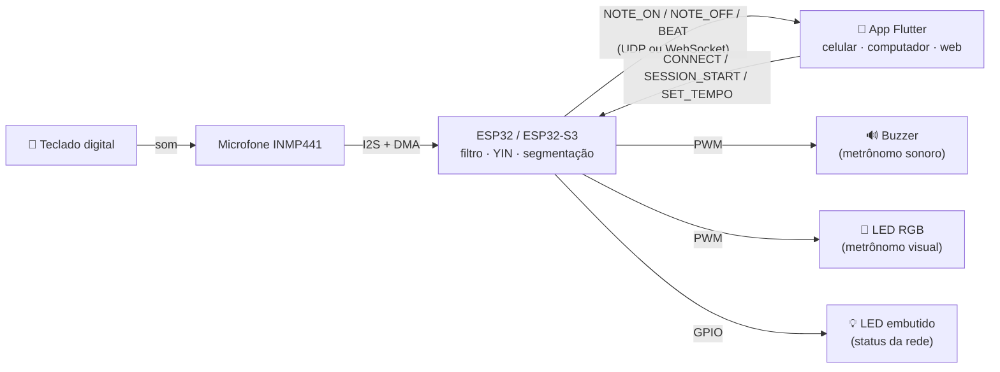
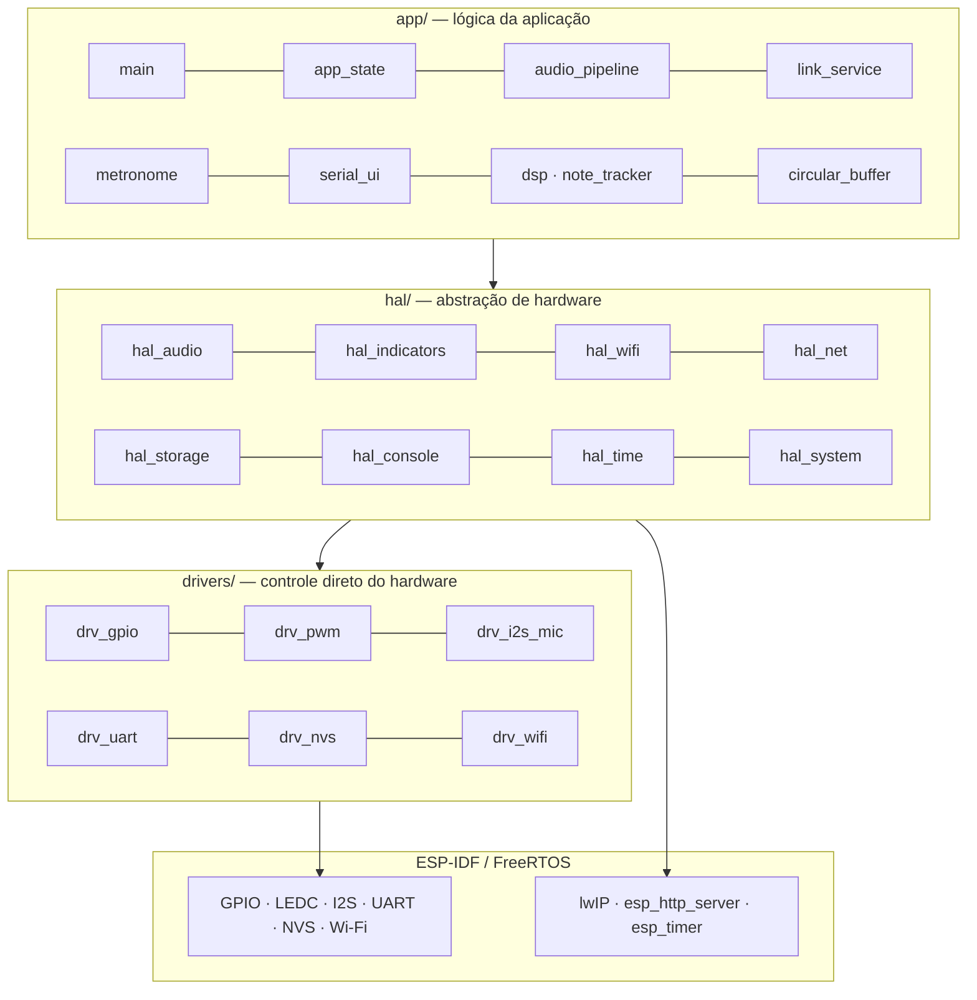
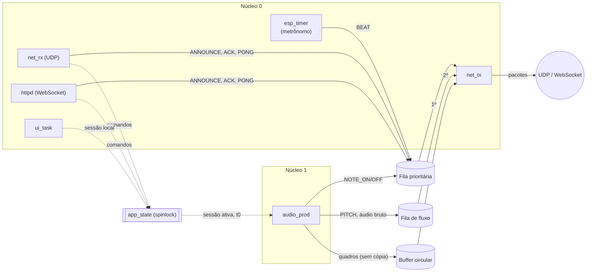
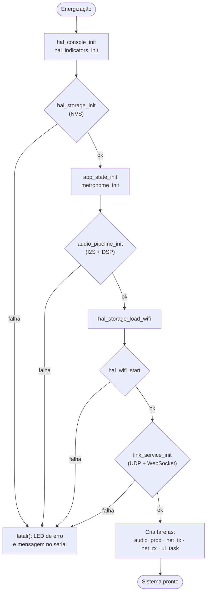
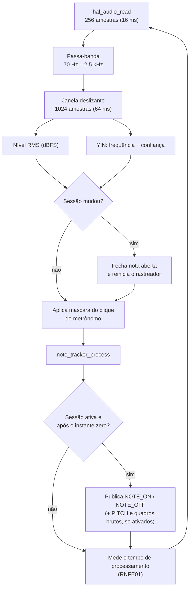
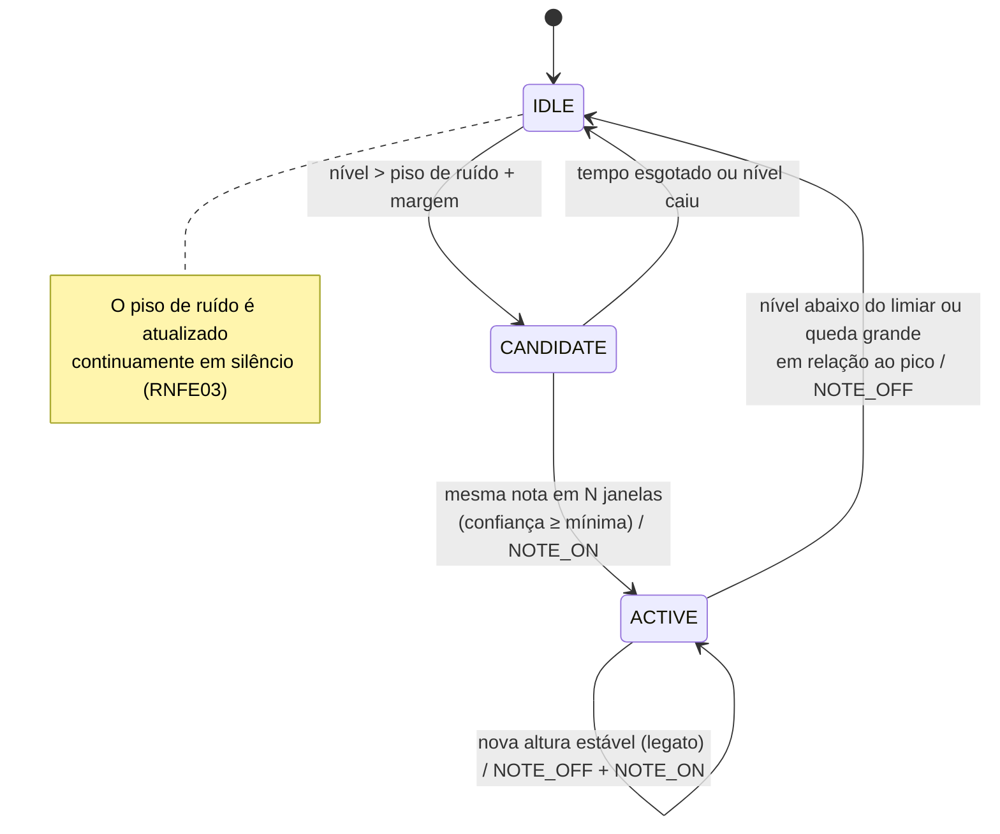
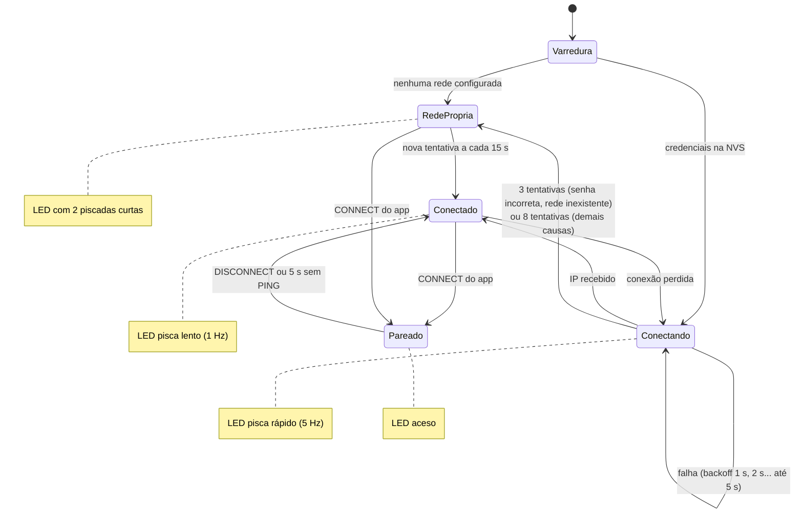
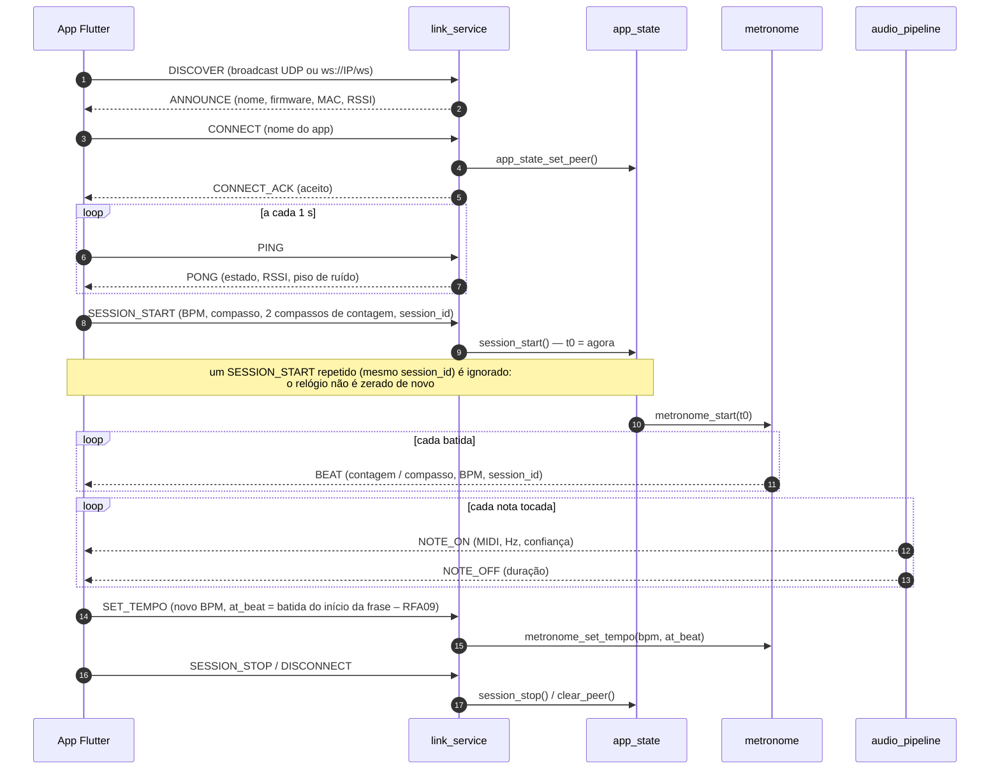

# firmware_I2S — Dispositivo de captação e detecção de notas

Firmware do dispositivo embarcado do TCC **Sistema de Processamento de Áudio com Feedback em Tempo Real Aplicado ao Ensino de Partitura**.

O dispositivo capta o som do teclado com o microfone digital **INMP441 (I2S)**, identifica as notas tocadas (altura e duração), envia os eventos ao [aplicativo Flutter](https://github.com/noggyamamoto/Flutter_App) por **Wi-Fi** e executa o metrônomo sonoro (buzzer) e visual (LED RGB). O app compara as notas recebidas com a partitura MusicXML e devolve o feedback ao aluno.

---

## Sumário

1. [Visão geral](#1-visão-geral)
2. [Requisitos atendidos](#2-requisitos-atendidos)
3. [Hardware](#3-hardware)
4. [Arquitetura de software](#4-arquitetura-de-software)
   - 4.1 [Camadas](#41-camadas)
   - 4.2 [Estrutura de diretórios](#42-estrutura-de-diretórios)
   - 4.3 [Módulos por camada](#43-módulos-por-camada)
   - 4.4 [Diagrama de classes (módulos)](#44-diagrama-de-classes-módulos)
   - 4.5 [Tarefas e concorrência](#45-tarefas-e-concorrência)
5. [Fluxos de funcionamento](#5-fluxos-de-funcionamento)
6. [Protocolo de comunicação](#6-protocolo-de-comunicação)
7. [Configuração](#7-configuração)
8. [Compilação e gravação](#8-compilação-e-gravação)
9. [Operação do dispositivo](#9-operação-do-dispositivo)
10. [Testes](#10-testes)
11. [Solução de problemas](#11-solução-de-problemas)
12. [Licença](#12-licença)

---

## 1. Visão geral



| Item | Descrição |
|---|---|
| Linguagem | C (C17) |
| Framework | ESP-IDF 5.x (FreeRTOS, `i2s_std`, LEDC, `esp_timer`, NVS, lwIP, `esp_http_server`) |
| Ferramentas | PlatformIO ou `idf.py` (ESP-IDF) |
| Placas | ESP32 DevKit V1 (MVP) e ESP32-S3 DevKitC-1 N16R8 (lista de materiais do TCC) |
| Áudio | 16 kHz, 24 bits, janelas de 16 ms (hop) e 64 ms (análise) |
| Comunicação | UDP (porta 54322) para celular/computador e WebSocket (`ws://IP/ws`) para o app web |

---

## 2. Requisitos atendidos

| Requisito (TCC) | Implementação | Módulo |
|---|---|---|
| **RFE01** – Verificação de rede | Varredura das redes, conexão com novas tentativas, rede própria de reserva (modo AP) e LED de status | `hal_wifi`, `hal_indicators`, `app_state` |
| **RFE02** – Metrônomo sonoro | Buzzer passivo por PWM, clique acentuado no tempo forte | `metronome`, `hal_indicators` |
| **RFE03** – Metrônomo visual | LED RGB: azul (binário), verde (ternário), roxo (quaternário), amarelo na contagem | `metronome`, `hal_indicators` |
| **RFE04** – Captação digital e filtragem | INMP441 via I2S (24 bits em slots de 32 bits) + passa-banda 70 Hz – 2,5 kHz | `drv_i2s_mic`, `hal_audio`, `dsp` |
| **RFE05** – Processamento digital de sinais | Altura pelo algoritmo **YIN** + segmentação em notas (ataque, soltura, duração) | `dsp`, `note_tracker`, `audio_pipeline` |
| **RFE06** – Transmissão de dados | Pacotes binários com sequência e timestamp, por UDP ou WebSocket | `link_service`, `hal_net` |
| **RNFE01** – Baixa latência | Janelas de 16 ms; tempo de processamento medido (menu serial, Status do sistema); notas com prioridade sobre os fluxos de diagnóstico | `audio_pipeline`, `app_state` |
| **RNFE02** – Calibração de timbre | Faixa de altura e limiares ajustados para teclado digital (`config.h`) | `config.h`, `note_tracker` |
| **RNFE03** – Imunidade a ruído | Passa-banda + piso de ruído adaptativo + limiar mínimo + máscara do clique | `dsp`, `note_tracker` |
| **RNFE04** – Tolerância temporal | Quantização dos tempos em 10 ms | `note_tracker` |
| **RNFA02** – Comunicação assíncrona | WebSocket para o app web e UDP para os apps nativos | `hal_net` |

---

## 3. Hardware

### 3.1 Lista de materiais

| Item | Qtd. | Função |
|---|---|---|
| ESP32-S3 N16R8 (ou ESP32 DevKit V1) | 1 | Aquisição, processamento e comunicação sem fio |
| Microfone INMP441 | 1 | Captação digital do som (I2S) |
| LED RGB catodo comum + 3 resistores 220 Ω | 1 | Metrônomo visual |
| Buzzer passivo + transistor NPN | 1 | Metrônomo sonoro |
| Regulador 7805 + fonte 9 V | 1 | Alimentação estável |
| Protoboard e jumpers | — | Montagem do protótipo |

### 3.2 Ligações

| INMP441 | ESP32 DevKit V1 | ESP32-S3 N16R8 |
|---|---|---|
| VDD | 3V3 | 3V3 |
| GND | GND | GND |
| L/R | GND (canal esquerdo) | GND |
| SCK | GPIO26 | GPIO5 |
| WS | GPIO25 | GPIO6 |
| SD | GPIO33 | GPIO4 |

| Indicador | ESP32 DevKit V1 | ESP32-S3 N16R8 |
|---|---|---|
| LED de status | GPIO2 (LED embutido) | GPIO2 |
| LED RGB (R / G / B) | GPIO27 / 14 / 13 | GPIO15 / 16 / 17 |
| Buzzer passivo (via transistor) | GPIO18 | GPIO18 |

Os pinos ficam em [`include/config.h`](MicroDetection/include/config.h) e são escolhidos automaticamente pelo alvo de compilação. Para LED RGB de anodo comum, use `RGB_LED_COMMON_ANODE 1`.

---

## 4. Arquitetura de software

### 4.1 Camadas

O firmware é organizado em três camadas com dependência em um único sentido: **app → hal → drivers**. A aplicação não acessa periféricos nem APIs de hardware do ESP-IDF diretamente, o que facilita testes, trocas de placa e manutenção.



| Camada | Responsabilidade | Pode usar |
|---|---|---|
| `drivers/` | Controle direto dos periféricos (configurar pinos, PWM, I2S, UART, flash, rádio) | ESP-IDF (drivers de periféricos) |
| `hal/` | Funções simples e reutilizáveis que escondem o hardware (ler áudio normalizado, piscar o LED, conectar ao Wi-Fi, enviar um pacote) | `drivers/`, serviços do ESP-IDF (timers, sockets, HTTP) |
| `app/` | Fluxo de controle, regras do produto, protocolo, DSP, metrônomo e interface com o usuário | `hal/`, FreeRTOS, log |
| `include/` | Cabeçalhos públicos de cada camada e configurações compartilhadas | — |

### 4.2 Estrutura de diretórios

```text
MicroDetection/
├── app/                      # lógica da aplicação (componente principal do ESP-IDF)
│   ├── CMakeLists.txt        # registra app/, hal/ e drivers/ em um único componente
│   ├── main.c                # app_main: inicialização em camadas e criação das tarefas
│   ├── app_state.c           # sessão, pareamento, fila de saída e LED de status
│   ├── audio_pipeline.c      # tarefa de áudio: microfone → DSP → eventos de nota
│   ├── dsp.c                 # passa-banda (biquads RBJ), nível RMS e detector YIN
│   ├── note_tracker.c        # segmentação em notas (ataque, soltura, reataque, quantização)
│   ├── metronome.c           # metrônomo sonoro/visual com contagem de entrada
│   ├── link_service.c        # protocolo com o app (comandos, respostas e eventos)
│   ├── serial_ui.c           # menu serial navegável (vermelho/branco), único conteúdo do terminal
│   ├── diagnostics.c         # problemas atuais explicados ao usuário (o que houve / o que fazer)
│   ├── ui_events.c           # avisos exibidos dentro do menu (app conectado, Wi-Fi caiu...)
│   └── circular_buffer.c     # buffer circular de quadros brutos (modo diagnóstico)
├── hal/                      # camada de abstração de hardware
│   ├── hal_audio.c           # amostras float normalizadas + instante de cada bloco
│   ├── hal_indicators.c      # LED de status, LED RGB e buzzer
│   ├── hal_wifi.c            # conexão com backoff, rede própria de reserva e causa das falhas
│   ├── hal_net.c             # transporte de pacotes: UDP e WebSocket
│   ├── hal_storage.c         # credenciais do Wi-Fi na memória não volátil
│   ├── hal_console.c         # terminal do menu + histórico do ESP_LOG (log técnico)
│   ├── hal_time.c            # relógio monotônico e temporizadores
│   └── hal_system.c          # reinício e memória livre
├── drivers/                  # controle direto de hardware
│   ├── drv_gpio.c            # saídas digitais (LED embutido)
│   ├── drv_pwm.c             # PWM por hardware (LEDC)
│   ├── drv_i2s_mic.c         # microfone INMP441 (I2S + DMA)
│   ├── drv_uart.c            # porta serial
│   ├── drv_nvs.c             # partição NVS da flash
│   └── drv_wifi.c            # rádio Wi-Fi (estação, ponto de acesso, varredura)
├── include/                  # cabeçalhos
│   ├── config.h              # pinos, parâmetros de áudio, DSP e rede
│   ├── protocol.h            # formato binário dos pacotes (espelhado no app)
│   ├── app/                  # cabeçalhos da camada de aplicação
│   ├── hal/                  # cabeçalhos da HAL
│   └── drivers/              # cabeçalhos dos drivers
├── test/host/                # testes no computador (gcc) e ferramentas
├── CMakeLists.txt            # projeto ESP-IDF
├── platformio.ini            # projeto PlatformIO (src_dir = app)
├── sdkconfig.defaults        # opções do ESP-IDF (WebSocket)
└── sdkconfig.esp32doit-devkit-v1
```

> O ESP-IDF já possui um componente chamado `hal`; por isso as três camadas são compiladas em um único componente (registrado em `app/CMakeLists.txt`), e a separação é garantida pelos diretórios de cabeçalhos e pela regra de dependência acima.

### 4.3 Módulos por camada

#### drivers/

| Módulo | Função | API principal |
|---|---|---|
| `drv_gpio` | Saída digital do LED embutido | `drv_gpio_output_init`, `drv_gpio_write` |
| `drv_pwm` | Temporizadores e canais LEDC | `drv_pwm_timer_init`, `drv_pwm_channel_init`, `drv_pwm_set_duty`, `drv_pwm_set_freq` |
| `drv_i2s_mic` | Canal I2S mestre RX (Philips, 32 bits, mono esquerdo) com DMA | `drv_i2s_mic_init`, `drv_i2s_mic_start`, `drv_i2s_mic_read` |
| `drv_uart` | UART0 do monitor serial | `drv_uart_init`, `drv_uart_write`, `drv_uart_read_byte` |
| `drv_nvs` | Leitura e escrita de strings na NVS | `drv_nvs_init`, `drv_nvs_get_str`, `drv_nvs_set_str` |
| `drv_wifi` | Rádio Wi-Fi e eventos (STA, AP, IP, varredura com segurança da rede); país BR, WPA2/WPA3 (SAE H2E), PMF opcional, 20 MHz | `drv_wifi_init`, `drv_wifi_connect`, `drv_wifi_enable_ap`, `drv_wifi_scan` |

#### hal/

| Módulo | Função | API principal |
|---|---|---|
| `hal_audio` | Áudio em `float` [-1, 1) com ganho e carimbo de tempo | `hal_audio_read`, `hal_audio_next_sample_time_us` |
| `hal_indicators` | Padrões do LED de status, flash do LED RGB, bipe | `hal_status_led_set`, `hal_rgb_flash`, `hal_buzzer_beep` |
| `hal_wifi` | Política de conexão (tentativas com backoff, AP de reserva, estado) e classificação das falhas (senha, rede inexistente, sinal, segurança, DHCP) | `hal_wifi_start`, `hal_wifi_reconnect`, `hal_wifi_get_diag`, `hal_wifi_scan` |
| `hal_net` | Datagramas por UDP e WebSocket com endereço único (`NetPeer`) | `hal_net_init`, `hal_net_send`, `hal_net_peer_equal` |
| `hal_storage` | Credenciais do Wi-Fi | `hal_storage_load_wifi`, `hal_storage_save_wifi` |
| `hal_console` | Terminal do menu; desvia o ESP_LOG para um histórico em memória | `hal_console_write`, `hal_console_read_byte`, `hal_console_capture_logs`, `hal_console_log_lines` |
| `hal_time` | Relógio e temporizadores | `hal_time_us`, `hal_timer_create`, `hal_timer_start_once` |
| `hal_system` | Sistema | `hal_system_restart`, `hal_system_free_heap` |

#### app/

| Módulo | Função |
|---|---|
| `main` | Inicializa as camadas em ordem, trata falhas críticas e cria as tarefas |
| `app_state` | Estado compartilhado (spinlock): app pareado, sessão (com `session_id`), flags, métricas, filas de saída com prioridade e padrão do LED de status |
| `audio_pipeline` | Tarefa produtora: lê o microfone, filtra, estima altura, segmenta notas, publica eventos e verifica o microfone (sem sinal, erro de I2S, saturação) |
| `dsp` | Passa-banda (cascata de biquads RBJ), nível RMS em dBFS, detector de altura YIN |
| `note_tracker` | Máquina de estados de notas (ver 5.3), piso de ruído adaptativo, reataque, quantização |
| `metronome` | Batidas em instantes absolutos (sem deriva), contagem de entrada, som e luz, troca de BPM em uma batida exata |
| `link_service` | Interpreta os comandos do app e monta/envia os pacotes de resposta e de eventos |
| `serial_ui` | Menu serial navegável: status, Wi-Fi (lista de redes, senha, detalhes), captura local, monitor de notas, afinador, metrônomo de teste, log técnico |
| `diagnostics` | Converte o estado do Wi-Fi, do microfone e do enlace em problemas com "o que fazer" |
| `ui_events` | Avisos recentes exibidos no menu (não bloqueante, chamado de qualquer tarefa) |
| `circular_buffer` | Buffer circular SPSC sem cópia (spinlock só no contador) para quadros de áudio bruto (diagnóstico) |

### 4.4 Diagrama de classes (módulos)

Em C, cada módulo funciona como uma classe com estado privado (`static`) e funções públicas declaradas em `include/`. O diagrama mostra os principais tipos, operações e dependências.

```mermaid
classDiagram
    direction TB

    class main {
        <<app>>
        +app_main()
        -fatal(what, action)
        -on_wifi_state(state)
    }
    class app_state {
        <<app>>
        -NetPeer peer
        -SessionInfo session
        -QueueHandle_t queue_ctrl
        -QueueHandle_t queue_stream
        -portMUX_TYPE lock
        +app_state_set_peer(peer, name)
        +app_state_session_start(bpm, beats, countIn, flags, local, sessionId) bool
        +app_state_session_stop()
        +app_state_post(OutEvent) bool
        +app_state_next_event(out, wait) bool
        +app_state_refresh_status_led()
    }
    class audio_pipeline {
        <<app>>
        -BandpassFilter filter
        -YinDetector yin
        -NoteTracker tracker
        +audio_pipeline_init() bool
        +audio_pipeline_start_task()
        +audio_pipeline_mask_click(untilMs, hz)
        +audio_pipeline_mic_status() MicStatus
    }
    class dsp {
        <<app>>
        +bandpass_process(filter, x, n)
        +yin_detect(yin, window, confidence) float
        +dsp_rms_db(x, n) float
        +dsp_hz_to_midi(hz) float
    }
    class note_tracker {
        <<app>>
        -TrackerState state
        -float noise_floor_db
        +note_tracker_process(t, ms, db, hz, conf, events) int
        +note_tracker_mask_until(t, ms, hz)
        +note_tracker_flush(t, ms, event) bool
    }
    class metronome {
        <<app>>
        -HalTimer timer
        +metronome_start(bpm, beats, countIn, flags, t0, sessionId)
        +metronome_set_tempo(bpm, atBeat)
        +metronome_stop()
    }
    class link_service {
        <<app>>
        +link_service_init() bool
        +link_service_start()
        -handle_packet(from, data, len)
        -tx_task()
    }
    class serial_ui {
        <<app>>
        +serial_ui_splash()
        +serial_ui_fatal(what, action)
        +serial_ui_start_task()
    }
    class diagnostics {
        <<app>>
        +diagnostics_collect(out, max) int
        +diagnostics_wifi_error_text(diag, buf, len)
    }
    class ui_events {
        <<app>>
        +ui_event(level, fmt)
        +ui_events_recent(out, max) int
    }
    class OutEvent {
        <<struct>>
        OutEventType type
        bool has_dest
        NetPeer dest
        uint32 timestamp_ms
    }

    class hal_audio {
        <<hal>>
        +hal_audio_init(n) bool
        +hal_audio_read(out, n, timeout) size_t
        +hal_audio_next_sample_time_us() int64
    }
    class hal_indicators {
        <<hal>>
        +hal_status_led_set(StatusPattern)
        +hal_rgb_flash(r, g, b, ms)
        +hal_buzzer_beep(hz, ms)
    }
    class hal_wifi {
        <<hal>>
        +hal_wifi_start(cred, onState) bool
        +hal_wifi_reconnect(cred)
        +hal_wifi_state() HalWifiState
        +hal_wifi_get_diag(out)
        +hal_wifi_scan(out, max) int
    }
    class hal_net {
        <<hal>>
        +hal_net_init(onReceive) bool
        +hal_net_send(NetPeer, data, len) bool
        +hal_net_peer_equal(a, b) bool
    }
    class NetPeer {
        <<struct>>
        NetPeerKind kind
        uint32 ip
        uint16 port
        int ws_fd
    }
    class hal_storage {
        <<hal>>
        +hal_storage_load_wifi(out)
        +hal_storage_save_wifi(cred) bool
    }
    class hal_console {
        <<hal>>
        +hal_console_write(text)
        +hal_console_read_byte(out, timeout) bool
        +hal_console_capture_logs()
        +hal_console_log_lines(out, max) int
    }
    class hal_time {
        <<hal>>
        +hal_time_us() int64
        +hal_timer_create(cb, arg, name) HalTimer
        +hal_timer_start_once(t, us)
    }

    class drv_i2s_mic {
        <<driver>>
        +drv_i2s_mic_init(cfg, n)
        +drv_i2s_mic_read(out, n, timeout)
    }
    class drv_gpio {
        <<driver>>
        +drv_gpio_output_init(pin)
        +drv_gpio_write(pin, level)
    }
    class drv_pwm {
        <<driver>>
        +drv_pwm_set_duty(ch, duty)
        +drv_pwm_set_freq(timer, hz)
    }
    class drv_wifi {
        <<driver>>
        +drv_wifi_init(cb)
        +drv_wifi_connect()
        +drv_wifi_enable_ap(ssid, pass, ch)
    }
    class drv_nvs {
        <<driver>>
        +drv_nvs_get_str(ns, key, out, n)
        +drv_nvs_set_str(ns, key, v)
    }
    class drv_uart {
        <<driver>>
        +drv_uart_write(port, data, len)
        +drv_uart_read_byte(port, out, timeout)
    }

    main ..> app_state
    main ..> audio_pipeline
    main ..> link_service
    main ..> serial_ui
    main ..> hal_wifi
    audio_pipeline ..> dsp
    audio_pipeline ..> note_tracker
    audio_pipeline ..> hal_audio
    audio_pipeline ..> app_state : publica OutEvent
    metronome ..> hal_indicators
    metronome ..> app_state : publica BEAT
    metronome ..> audio_pipeline : máscara do clique
    link_service ..> app_state : consome as filas
    link_service ..> hal_net
    link_service ..> metronome
    app_state ..> hal_indicators
    app_state ..> hal_wifi
    app_state "1" o-- "0..1" NetPeer : app pareado
    app_state "1" o-- "*" OutEvent : filas de saída
    serial_ui ..> hal_console
    serial_ui ..> hal_storage
    serial_ui ..> hal_wifi
    serial_ui ..> diagnostics
    serial_ui ..> ui_events
    diagnostics ..> hal_wifi
    diagnostics ..> audio_pipeline
    app_state ..> ui_events
    link_service ..> ui_events
    hal_audio ..> drv_i2s_mic
    hal_indicators ..> drv_gpio
    hal_indicators ..> drv_pwm
    hal_indicators ..> hal_time
    hal_wifi ..> drv_wifi
    hal_storage ..> drv_nvs
    hal_console ..> drv_uart
    hal_net ..> NetPeer
```



### 4.5 Tarefas e concorrência

| Tarefa | Núcleo | Prioridade | Função |
|---|---|---|---|
| `audio_prod` | 1 | 5 | Microfone → DSP → eventos (núcleo exclusivo para não perder amostras) |
| `net_tx` | 0 | 4 | Consome as filas de saída e envia pacotes (UDP ou WebSocket) |
| `net_rx` | 0 | 3 | Recebe comandos UDP |
| `httpd` | 0 | 5 (padrão) | Servidor WebSocket do app web |
| `esp_timer` | 0 | 22 | Batidas do metrônomo, desligamento do LED/buzzer, monitor de PING, tentativas de Wi-Fi |
| `ui_task` | 0 | 1 | Menu serial |
| `status_led` | 0 | 1 | Animação do LED de status |

#### Sincronização (análise e escolhas)

| Recurso compartilhado | Quem acessa | Mecanismo | Por quê |
|---|---|---|---|
| `app_state` (sessão, app pareado, flags, contadores) | áudio (a cada 16 ms), rede, menu e **callbacks de timer** (metrônomo, watchdog do PING) | **spinlock** (`portMUX`) | As seções críticas só copiam poucos bytes. Com o **mutex** do MVP, a tarefa de áudio (prioridade 5, núcleo 1) podia ficar bloqueada esperando uma tarefa de prioridade menor no núcleo 0 – que por sua vez pode ser preemptada pelo Wi-Fi (prioridade 23) – e os callbacks do `esp_timer` não devem bloquear. O spinlock não bloqueia, não troca de contexto e não sofre inversão de prioridade. |
| Saída para a rede | áudio, metrônomo, recepção UDP/WebSocket → `net_tx` | **duas filas FreeRTOS** + **notificação de tarefa** | Fila *prioritária* (32: respostas, `NOTE_ON/OFF`, `BEAT`) e fila de *fluxo* (16: `PITCH`, áudio bruto). Produtores usam timeout 0 (nunca bloqueiam); o consumidor dorme em `ulTaskNotifyTake` e sempre esvazia a fila prioritária primeiro. Assim o fluxo de diagnóstico nunca atrasa nem descarta uma nota. Perdas são contadas separadamente. |
| Buffer circular de áudio bruto (4 quadros) | áudio (escreve) → `net_tx` (lê) | **SPSC sem cópia** + spinlock só no contador | O produtor escreve no slot da cauda e o consumidor envia direto do slot da cabeça (o cabeçalho do pacote fica no próprio slot): sem `memcpy` de 2 KB dentro de uma seção crítica e sem bloqueio. Buffer cheio descarta o quadro novo (o slot em transmissão nunca é sobrescrito). Quadros de uma sessão anterior são descartados pelo número de geração. |
| Máscara do clique, últimas notas, avisos do menu, log técnico | várias tarefas | spinlock | Dados pequenos, escritos e lidos em poucas instruções. |
| Envio por WebSocket | `net_tx` | `send_wait_timeout` = 1 s | O padrão (5 s) podia prender a transmissão com um cliente lento e encher as filas. |

O único ponto em que uma tarefa bloqueia esperando outra é o **consumidor** (`net_tx`) aguardando eventos – o comportamento desejado. A tarefa de áudio só bloqueia na leitura do I2S (DMA), que é o seu relógio.



---

## 5. Fluxos de funcionamento

### 5.1 Inicialização



### 5.2 Processamento de áudio (a cada 16 ms)



### 5.3 Segmentação de notas



### 5.4 Conexão Wi-Fi e LED de status



### 5.5 Pareamento e execução com o app



### 5.6 Metrônomo

As batidas são agendadas em **instantes absolutos** a partir de `t0` (início da sessão), evitando deriva acumulada. O app calcula a sua linha do tempo com **o mesmo BPM inteiro** enviado ao metrônomo e alinha o relógio pelas batidas recebidas; a troca de andamento acontece na batida `at_beat` informada pelo app (início exato da frase), e não "na próxima batida após o pacote chegar". Durante os compassos de contagem, som e luz são sempre acionados (aviso de preparação – RFA05/RU07); depois, seguem as opções do app. A cada clique, o pipeline de áudio recebe uma máscara para não confundir o som do buzzer com uma nota.

---

## 6. Protocolo de comunicação

Definido em [`include/protocol.h`](MicroDetection/include/protocol.h) e espelhado no app em `lib/features/connection/data/protocol/device_protocol.dart`.

### 6.1 Transportes

| Transporte | Endereço | Usado por |
|---|---|---|
| UDP | porta **54322** (descoberta por broadcast) | App no Android, iOS, Windows, macOS e Linux |
| WebSocket | `ws://IP_DO_DISPOSITIVO/ws` (porta 80), uma mensagem binária por pacote | App na web (o navegador não tem UDP) |

### 6.2 Cabeçalho (12 bytes, little-endian)

| Campo | Tipo | Descrição |
|---|---|---|
| `magic` | `uint16` | `0x5443` ("TC") |
| `version` | `uint8` | Versão do protocolo (1) |
| `type` | `uint8` | Tipo do pacote |
| `sequence` | `uint32` | Número sequencial (detecção de perdas) |
| `timestamp_ms` | `uint32` | Tempo desde o início da sessão (o instante 0 é o início da contagem) |

### 6.3 Pacotes

| Código | App → dispositivo | Conteúdo |
|---|---|---|
| `0x01` | `DISCOVER` | — |
| `0x02` | `CONNECT` | nome do app |
| `0x03` | `DISCONNECT` | — |
| `0x04` | `PING` | — (a cada 1 s) |
| `0x05` | `CONFIG` | BPM, tempos por compasso, flags |
| `0x06` | `SESSION_START` | BPM, tempos por compasso, compassos de contagem, flags, `session_id` (reenvio com o mesmo id é ignorado) |
| `0x07` | `SESSION_STOP` | — |
| `0x08` | `SET_TEMPO` | novo BPM e `at_beat`: índice da batida (contagem incluída) em que o novo BPM começa; 0 = próxima batida |

| Código | Dispositivo → app | Conteúdo |
|---|---|---|
| `0x81` | `ANNOUNCE` | nome, versão do firmware, MAC, estado, RSSI, taxa de amostragem |
| `0x82` | `CONNECT_ACK` | aceito (1) ou em uso por outro app (0) |
| `0x83` | `PONG` | estado, RSSI, piso de ruído, eventos descartados |
| `0x84` | `NOTE_ON` | nota MIDI, frequência, nível, confiança |
| `0x85` | `NOTE_OFF` | nota MIDI, duração, frequência média |
| `0x86` | `PITCH` | frequência contínua (afinador, opcional) |
| `0x87` | `BEAT` | tempo no compasso, contagem, índice do compasso, BPM, `session_id` |
| `0x88` | `AUDIO_FRAME` | 1024 amostras PCM 16 bits + energia (diagnóstico) |

Flags (`CONFIG`/`SESSION_START`): `0x01` metrônomo sonoro · `0x02` metrônomo visual · `0x04` áudio bruto · `0x08` altura contínua.

Os campos `session_id` e `at_beat` ocupam bytes que eram reservados (zero), então apps e firmwares anteriores continuam compatíveis.

Regras: somente o app pareado controla a sessão; outro app só assume o dispositivo se o anterior ficar 5 s sem enviar `PING` (RU02); `DISCONNECT` libera o dispositivo imediatamente (RU17).

---

## 7. Configuração

Principais parâmetros de [`include/config.h`](MicroDetection/include/config.h):

| Grupo | Parâmetro | Padrão | Descrição |
|---|---|---|---|
| Áudio | `SAMPLE_RATE` | 16000 | Taxa de amostragem (Hz) |
| | `HOP_SAMPLES` / `WINDOW_SAMPLES` | 256 / 1024 | Passo (16 ms) e janela de análise (64 ms) |
| | `INPUT_GAIN` | 4.0 | Ganho digital do INMP441 |
| DSP | `BANDPASS_LOW_HZ` / `BANDPASS_HIGH_HZ` | 70 / 2500 | Faixa do filtro |
| | `PITCH_MIN_HZ` / `PITCH_MAX_HZ` | 65 / 2100 | Faixa de altura (C2 – C7) |
| | `YIN_THRESHOLD` / `MIN_CONFIDENCE` | 0.15 / 0.70 | Limiar do YIN e confiança mínima |
| Notas | `GATE_MARGIN_DB` / `GATE_MIN_DB` | 12 / −62 | Margem sobre o piso de ruído e limiar absoluto |
| | `STABLE_HOPS` / `MIN_NOTE_MS` | 2 / 60 | Confirmação da altura e duração mínima |
| | `QUANTIZE_MS` | 10 | Quantização temporal (RNFE04) |
| | `CLICK_MASK_MS` | 45 | Máscara do clique do metrônomo |
| Rede | `WIFI_MAX_RETRIES` / `WIFI_FATAL_RETRIES` | 8 / 3 | Tentativas antes da rede própria (3 quando a causa não se resolve sozinha: senha incorreta, rede inexistente) |
| | `WIFI_COUNTRY_CODE` | `BR` | Canais 1–13 (modems nos canais 12 e 13) |
| | `WIFI_DHCP_TIMEOUT_MS` | 12000 | Associado, mas sem IP: falha "DHCP" |
| | `WIFI_AP_PASS` / `WIFI_AP_CHANNEL` | `partitura123` / 6 | Rede própria |
| | `WS_PORT` | 80 | Servidor WebSocket |
| | `SESSION_TIMEOUT_MS` | 5000 | Tempo sem `PING` para liberar o dispositivo |
| | `EVENT_QUEUE_LENGTH` / `STREAM_QUEUE_LENGTH` | 32 / 16 | Fila prioritária (notas, batidas) e de fluxo (altura, áudio bruto) |
| | `WS_SEND_TIMEOUT_S` | 1 | Tempo máximo de um envio por WebSocket |
| Menu | `SERIAL_UI_ANSI` | 1 | Cores e cursor ANSI; 0 para terminais sem ANSI (ex.: IDE Arduino) |
| | `SERIAL_UI_IDLE_RESET_MS` | 20000 | Sem tecla por 20 s após uma interação, o menu volta ao início |

As opções do ESP-IDF necessárias (suporte a WebSocket no `esp_http_server`) estão em `sdkconfig.defaults`.

---

## 8. Compilação e gravação

### 8.1 PlatformIO (recomendado)

```bash
cd MicroDetection
pio run -e esp32doit-devkit-v1 -t upload      # ESP32 DevKit V1
pio run -e esp32-s3-devkitc-1 -t upload       # ESP32-S3 N16R8
pio device monitor                            # 115200 bps
```

### 8.2 ESP-IDF (`idf.py`)

```bash
cd MicroDetection
idf.py set-target esp32        # ou esp32s3
idf.py build flash monitor
```

Sem o ESP-IDF instalado, a imagem oficial em Docker compila o projeto:

```bash
docker run --rm -v "$PWD":/project -w /project espressif/idf:v5.5.3 \
    idf.py -B build-esp32 -DSDKCONFIG=/project/sdkconfig.esp32doit-devkit-v1 build
```

> Validação desta versão (1.1.0): compilação sem avisos com ESP-IDF 5.5.3 para **ESP32** (`MicroDetection.bin` ≈ 882 KB, 14% livre na partição) e **ESP32-S3** (≈ 874 KB, 15% livre).

---

## 9. Operação do dispositivo

### 9.1 Wi-Fi

Na primeira execução não há rede configurada: o dispositivo cria a rede **PartituraIoT-XXXX** (senha `partitura123`, IP `192.168.4.1`). Para usar a rede da escola/casa, abra o monitor serial e escolha **2 – Rede Wi-Fi › 1 – Escolher rede da lista**, selecione a rede com as setas e digite a senha (TAB mostra o que foi digitado); as credenciais ficam salvas na NVS. O app precisa estar na mesma rede do dispositivo.

Compatibilidade com modems domésticos (corrigida nesta versão):

- **WPA3 / WPA2-WPA3**: o SAE agora aceita os dois métodos (hunt-and-peck e hash-to-element). Antes a configuração zerada usava só o primeiro, recusado por modems Wi-Fi 6 em WPA3 – enquanto o roteador do celular (WPA2) funcionava;
- **canais 12 e 13**: país `BR` configurado (antes, modo mundial com canais 1–11 ativos);
- **PMF (802.11w)** opcional e canal de **20 MHz**;
- SSID de 32 caracteres e chave hexadecimal de 64 dígitos aceitos.

Se ainda assim não conectar, o menu mostra a causa (senha incorreta, rede não encontrada, rede de 5 GHz, sinal fraco, segurança incompatível, modem recusou – filtro de MAC –, sem IP do DHCP) e o que fazer.

No **app web**, a busca automática por broadcast não existe: informe o IP do dispositivo (exibido no topo do menu serial) ou conecte o computador à rede própria do dispositivo e use `192.168.4.1`. Abra o app web por `http://` (páginas `https://` não podem abrir conexões `ws://` sem criptografia).

### 9.2 LED de status

| Padrão | Significado |
|---|---|
| Piscando rápido | Conectando ao Wi-Fi |
| Duas piscadas curtas | Rede própria (modo AP) ativa |
| Piscando lento | Wi-Fi conectado, aguardando o app |
| Aceso | App pareado |
| Piscando (erro) | Falha crítica na inicialização (ver monitor serial) |

### 9.3 Menu serial (115200 bps)

O terminal mostra **somente o menu** (as mensagens técnicas do ESP_LOG vão para *Log técnico*). A tela é redesenhada no lugar, em vermelho e branco: no topo, o estado do Wi-Fi, do app, do microfone e da sessão; abaixo, os **problemas atuais com o que fazer** e os últimos avisos; por fim, as opções.

```
  PARTITURA IoT  ·  firmware 1.1.0  ·  PartituraIoT-B2C3
 Wi-Fi   conectando a "CasaDoAluno"...
 App     aguardando conexão
 Mic     OK    Sessão  parada
────────────────────────────────────────────────────────────────────────────
 ! Senha incorreta para a rede "CasaDoAluno"
   > Menu 2 > 1: digite a senha de novo (maiúsculas contam; TAB mostra).
   > Se a senha estiver certa, reinicie o modem e use o Menu 2 > 3.
   > Modem em "somente WPA3"? Troque para "WPA2/WPA3" ou "WPA2".
────────────────────────────────────────────────────────────────────────────
 MENU PRINCIPAL
  ▸ 1  Status do sistema
    2  Rede Wi-Fi  ›
    3  Captura e áudio  ›
    4  Log técnico
    5  Reiniciar dispositivo

 ↑/↓ mover · ENTER escolher · 1-5 atalho
 Sem tecla por 20 s, o menu volta ao início.
```

| Menu | Opções |
|---|---|
| 1 – Status do sistema | IP, sessão, metrônomo, notas detectadas, pacotes e erros, eventos perdidos, buffer, nível de entrada, piso de ruído, tempo de processamento por janela, memória livre (ao vivo) |
| 2 – Rede Wi-Fi | 1 Escolher rede da lista · 2 Digitar o nome (rede oculta) · 3 Tentar conectar de novo · 4 Detalhes da conexão (causa da falha, tentativa, sinal, canal, segurança, MAC) |
| 3 – Captura e áudio | 1 Iniciar/parar captura local · 2 Monitor de notas · 3 Afinador e nível do microfone · 4 Testar metrônomo · 5 Envio de áudio bruto |
| 4 – Log técnico | Últimas linhas do ESP_LOG |
| 5 – Reiniciar dispositivo | Pede confirmação |

Navegação: **↑/↓** e **ENTER**, ou o número da opção; **ESC**/**←** volta. Depois de qualquer interação, **20 s sem tecla** fazem o menu voltar ao início (o que estava sendo digitado é descartado). Funciona no monitor do PlatformIO (`monitor_filters = direct`), PuTTY, screen e minicom; no Monitor Serial da IDE Arduino (sem ANSI) use `SERIAL_UI_ANSI 0`.

Problemas diagnosticados e explicados no menu:

| Área | Situações |
|---|---|
| Wi-Fi | nenhuma rede cadastrada · senha com tamanho inválido · **senha incorreta** · **rede inexistente** (com sugestão de nome parecido e aviso de 5 GHz) · segurança incompatível · sinal fraco · modem recusou (filtro de MAC/limite) · sem IP (DHCP) · conexão caiu · rede própria ativa |
| Microfone | sem sinal (fios do INMP441, com os pinos da placa) · I2S sem amostras · saturação · falha ao iniciar |
| App | aguardando conexão (com o IP para "Conectar pelo IP") · app parou de responder · falhas de envio · eventos perdidos por rede lenta |

---

## 10. Testes

| Teste | Comando | O que valida |
|---|---|---|
| DSP no computador | `make -C MicroDetection/test/host` | Filtro, YIN e segmentação com sinais sintéticos de teclado, ruído de sala e cliques do metrônomo |
| Dispositivo falso (UDP) | `make -C MicroDetection/test/host fake_device && ./MicroDetection/test/host/fake_device` | Protocolo completo para testar o app sem hardware (descoberta, pareamento, batidas e escala de Dó) |
| Ponte WebSocket | `python3 MicroDetection/test/host/ws_bridge.py 80` (com o `fake_device` rodando) | App web conversando com o dispositivo falso por `ws://127.0.0.1/ws` |
| Compilação do firmware | ver seção 8 | ESP32 e ESP32-S3 |

Testes de integração no repositório do app:

```bash
# App nativo (UDP)
FAKE_DEVICE=/caminho/fake_device flutter test test/connection/udp_device_test.dart

# App web (WebSocket, no Chrome)
flutter test --platform chrome --dart-define=WS_DEVICE=true \
    test/connection/websocket_device_test.dart
```

---

## 11. Solução de problemas

| Sintoma | Causa provável | Ação |
|---|---|---|
| LED pisca rápido sem parar | Rede ou senha incorretas | O topo do menu serial mostra a causa e o que fazer; Menu 2 › 1 para escolher a rede e digitar a senha |
| Conecta no roteador do celular, mas não no modem | Modem em WPA3 (H2E), canal 12/13, 5 GHz ou filtro de MAC | Versão 1.1.0 corrige WPA3 e canais; para 5 GHz/filtro, siga o diagnóstico do menu (Menu 2 › 4) |
| App não encontra o dispositivo | Redes diferentes ou broadcast bloqueado (isolamento de clientes, celular em 5 GHz) | Use "Conectar pelo IP" no app (IP no topo do menu serial) |
| App web não conecta | Página aberta por `https://` ou IP errado | Abra o app web por `http://` e informe o IP do dispositivo |
| Menu mostra "Microfone sem sinal" | Ligações do INMP441 | Confira SCK/WS/SD, VDD em 3V3 e L/R em GND (o menu mostra os pinos da placa) |
| Notas falsas com o metrônomo | Buzzer muito próximo do microfone | Afaste o buzzer ou reduza o volume; ajuste `CLICK_MASK_MS` |
| Notas não detectadas | Nível baixo | Aproxime o microfone ou aumente `INPUT_GAIN`; verifique nível e piso de ruído no afinador (Menu 3 › 3) |

---

## 12. Licença

Distribuído sob a licença do repositório (ver [`LICENSE`](LICENSE)). O histórico da concepção inicial do projeto está em [`docs/historico-concepcao.md`](docs/historico-concepcao.md).
